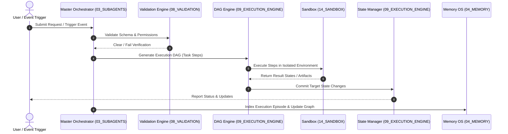

# 🏗️ Antigravity Architecture Overview

## 🌌 Introduction

The Antigravity Platform is engineered as a highly modular, layered system designed to coordinate autonomous agents while maintaining strict safety, validation, and execution controls. The design isolates governance, operations, execution, and support mechanisms to prevent monolithic creeping and cyclic dependencies.

---

## 🏛️ The Layered Architecture

Antigravity operates across five distinct architectural tiers, from core governance to supporting utilities.

```
+-------------------------------------------------------------+
| TIER 0: PLATFORM ROOT (README.md)                           |
+-------------------------------------------------------------+
                              |
+-------------------------------------------------------------+
| TIER 1: CORE GOVERNANCE (Brain, Global Rules)                |
+-------------------------------------------------------------+
                              |
+-------------------------------------------------------------+
| TIER 2: OPERATIONS (Subagents, Skills, Memory, MCP)          |
+-------------------------------------------------------------+
                              |
+-------------------------------------------------------------+
| TIER 3: INFRASTRUCTURE (Execution Engine, Validation, Security)|
+-------------------------------------------------------------+
                              |
+-------------------------------------------------------------+
| TIER 4: SYSTEM SUPPORT (Sandbox, Logs, Backups, Secrets)    |
+-------------------------------------------------------------+
```

### 1. Tier 0: Platform Root
Serves as the central entry point and Obsidian vault index. It maps the structure of all 18 modules.

### 2. Tier 1: Core Brain & Governance
*   **00_CORE_BRAIN**: Holds the absolute identity (`SYSTEM_DNA.yaml`), constitution (`SYSTEM_CONSTITUTION.md`), and high-level architecture.
*   **01_GLOBAL_RULES**: Programmatically enforceable rule sets covering coding standards, naming conventions, memory isolation, and validation protocols.

### 3. Tier 2: Operational Layer
*   **03_SUBAGENTS**: Autonomous execution entities (e.g. Planning, Architect, Coding, and domain-specific agents).
*   **02_SKILLS**: Stateless capabilities registry (e.g. robotics solvers, git controllers).
*   **04_MEMORY**: Multi-tiered knowledge store containing vector embeddings, episodic graphs, and project contexts.
*   **05_MCP**: Model Context Protocol connections extending agent tool capabilities to local databases and applications.

### 4. Tier 3: Infrastructure Layer
*   **09_EXECUTION_ENGINE**: Contains the DAG scheduler, runtime executor, and state manager.
*   **08_VALIDATION**: Enforces verification pipelines (schema checks, syntax checks, security scans) before any execution occurs.
*   **07_SECURITY**: Defines role-based access controls, sandbox parameters, and authorization limits.
*   **06_AUTOMATION**: Manages file-system watchers, cron timers, and automatic background tasks.
*   **10_PROJECT_INTELLIGENCE**: Parses incoming project workspaces and classifications.
*   **11_KNOWLEDGE_GRAPH**: Connects all documentation, memory, and code entities semantically.

### 5. Tier 4: Support Layer
*   Provides fundamental services: logging (`12_SYSTEM_LOGS`), backups (`13_BACKUPS`), secure sandboxed execution (`14_SANDBOX`), failure recovery (`15_RECOVERY`), configuration hierarchy (`16_CONFIG`), and secrets storage (`17_SECRETS`).

---

## 🔄 Data Flow & Execution Pipeline

Below is the standard execution loop for any agentic or automated workflow inside the platform.



---

## 🚫 Import and Dependency Rules

1.  **Directed Acyclic Graph (DAG) Rules**: No circular imports are allowed. For example, `08_VALIDATION` can import from `01_GLOBAL_RULES`, but `01_GLOBAL_RULES` must never import from `08_VALIDATION`.
2.  **Explicit Communication**: All operations across module boundaries must occur via validated JSON/YAML interfaces defined in [[communication_protocol]] and [[execution_schema.yaml]].
3.  **Low-level Independence**: Core infrastructure modules must be runnable in isolation without loading the full operational layer.
