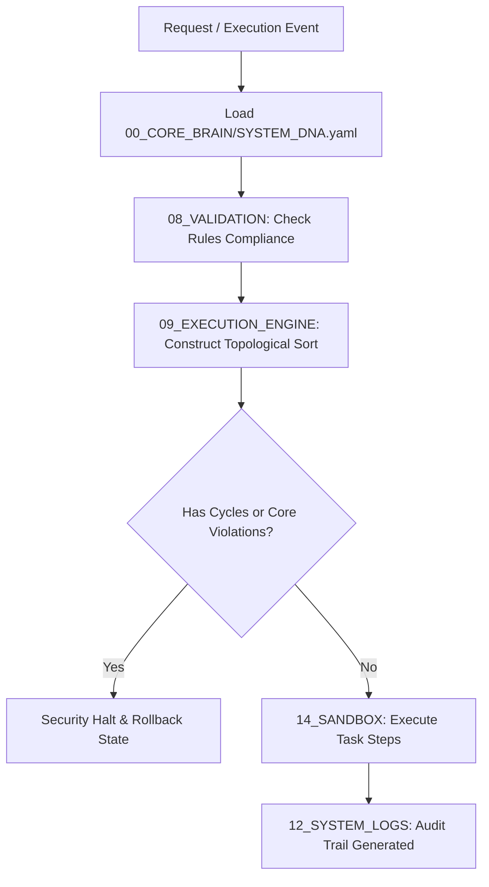

# 🧠 Antigravity Core Brain (Module 00) — Specification Document
**Version**: 1.0.0  
**Classification**: Supreme Governance and Identity Layer  
**Status**: Active / Enforced  

---

## 🌌 1. Executive Summary & Purpose

The **Core Brain** (`00_CORE_BRAIN`) is the supreme governance, identity, and architectural definition layer of the Antigravity Platform. It serves as the foundational "trust root" and decision-making authority of the ecosystem. All modules, subagents, and automated workflows are programmatically and operationally bound by the parameters, rules, and rules of engagement declared in this module.

The Core Brain's primary objective is to maintain system integrity, verify absolute modularity, prevent structural degradation (architectural drift), and enforce strict safety standards in multi-domain project execution—specifically for high-reliability systems like robotics software, hardware layouts, and physics simulation code.

---

## 🏛️ 2. Architectural Tiering & Governance

The Antigravity platform operates as a strictly tiered modular ecosystem. The Core Brain sits at **Tier 1** (Governance), dictating behavior to all downstream layers.

```
+-----------------------------------------------------------------------------+
| TIER 0: PLATFORM ROOT (Obsidian Vault Index & Workspace Boundary)          |
+-----------------------------------------------------------------------------+
                                       |
+-----------------------------------------------------------------------------+
| TIER 1: CORE GOVERNANCE (00_CORE_BRAIN, 01_GLOBAL_RULES)                    |
| Enforces the system identity, philosophy, and global code behavior.        |
+-----------------------------------------------------------------------------+
                                       |
+-----------------------------------------------------------------------------+
| TIER 2: OPERATIONS (03_SUBAGENTS, 02_SKILLS, 04_MEMORY, 05_MCP)            |
| Provides stateless capabilities, agent execution loops, and memory stores.  |
+-----------------------------------------------------------------------------+
                                       |
+-----------------------------------------------------------------------------+
| TIER 3: INFRASTRUCTURE (09_EXECUTION_ENGINE, 08_VALIDATION, 07_SECURITY)     |
| Manages the execution pipeline DAGs, safety checks, and sandbox rules.       |
+-----------------------------------------------------------------------------+
                                       |
+-----------------------------------------------------------------------------+
| TIER 4: SUPPORT (12_SYSTEM_LOGS, 13_BACKUPS, 14_SANDBOX, 15_RECOVERY, etc.) |
| Offers fundamental runtime utilities, isolation barriers, and recovery.     |
+-----------------------------------------------------------------------------+
```

### Immutable Security Boundaries
1. **Write Block**: Files located in `00_CORE_BRAIN` and `01_GLOBAL_RULES` are marked as **Immutable Zones** in the System DNA. No subagent or automated builder is allowed to modify these files. Any write attempt will result in an immediate execution termination, rollback, and security escalation.
2. **Access Control**: Read access is open to all system agents to allow continuous linting, verification, and rule-alignment checks.

---

## 📜 3. Document Governance & Schema Definitions

The Core Brain translates system philosophy and operational boundaries into three primary artifacts:

| Document | Format | Purpose | Key Contents |
| :--- | :--- | :--- | :--- |
| **`SYSTEM_CONSTITUTION.md`** | Markdown (GFM) | Philosophical & Ethical Foundation | Immutable Architectural Laws, Validation Chains, Operational Ethics |
| **`SYSTEM_DNA.yaml`** | YAML | Operational Identity & Parameters | Active Modules, Segmented Memory Layers, Agent Constraints, Domain Scopes |
| **`ARCHITECTURE_OVERVIEW.md`** | Markdown + Mermaid | High-level Technical Map | Communication Models, Data Flow sequences, Import/Dependency DAG rules |

### 3.1. The Constitution (`SYSTEM_CONSTITUTION.md`)
Declares the core principles that govern human-agent collaboration and subagent behaviors:
- **Modularity Enforced**: All platform capabilities must be stateless, isolated, and self-contained within the `02_SKILLS` registry.
- **DAG Import Rule**: The import graph between modules and files must be a Directed Acyclic Graph. No circular dependency loops are permitted.
- **Validation-First Gate**: Zero unvalidated execution. Every task execution must run through the Tier 3 Validation pipeline prior to scheduling.
- **Zero-Trust Secrets**: Passwords, API keys, and private tokens must never be written to disk. Injection must use environment-based vaults or runtime injections.

### 3.2. System DNA (`SYSTEM_DNA.yaml`)
A machine-readable configuration declaring the exact boundaries of the platform:
- **Priorities Hierarchy**: Dictates optimization decisions in order:
  $$\text{Reliability} \rightarrow \text{Determinism} \rightarrow \text{Validation} \rightarrow \text{Maintainability} \rightarrow \text{Security}$$
- **Segmented Memory Scopes**: Isolates global, project-specific, and vector context layers to prevent cross-contamination.
- **Subagent Permissions**: Restricts subagent capabilities (isolated execution, domain restrictions, zero direct core modification).

---

## ⚙️ 4. Runtime Enforcement & Integration Model

The Core Brain's constraints are not static documentation; they are programmatically enforced at the runtime level.



### 4.1. Core Validation Integration (`08_VALIDATION`)
Whenever a process is initiated, the Validation Engine checks the transaction scope against the `SYSTEM_DNA.yaml` restrictions:
1. **Schema Check**: Confirms target parameters match the required JSON/YAML schemas.
2. **Access Control Verification**: Ensures the executing entity (e.g. a specific subagent) has appropriate permissions listed in the DNA.

### 4.2. State Manager Interfacing (`09_EXECUTION_ENGINE`)
The State Manager monitors the execution context. If a write operation targets an immutable zone defined in the DNA (`00_CORE_BRAIN`, `01_GLOBAL_RULES`, `07_SECURITY`), the State Manager immediately triggers the recovery system:
- Execution processes are halted.
- The workspace is rolled back to the last clean version using local backups.
- A critical security warning is logged.

---

## 🔗 5. Obsidian Semantic Graph & Conventions

To maintain a searchable, well-organized knowledge graph, all documents in the Core Brain must adhere to strict styling and linking formats:

- **Wikilinks Integration**: Inter-document references must use standard Obsidian double-bracket links (e.g., `[[SYSTEM_CONSTITUTION]]`, `[[SYSTEM_DNA.yaml]]`).
- **Standard Layout**: Every core document must begin with a clear metadata header and a modular table of contents.
- **AI-Human Co-Readability**: Markdown structure must utilize standard GitHub Flavored Markdown (GFM) tables, lists, and Mermaid flowcharts to ensure ease of parsing by both human developers and LLM-based subagents.
