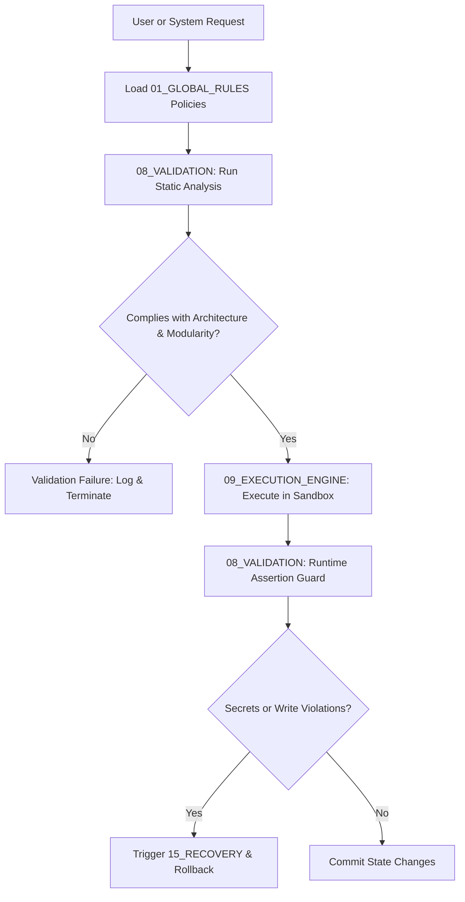

# 📜 Antigravity Global Rules (Module 01) — Specification Document
**Version**: 1.0.0  
**Classification**: Tier 1 Governance & Policy Engine  
**Status**: Active / Enforced  

---

## 🌌 1. Executive Summary & Purpose

The **Global Rules** module (`01_GLOBAL_RULES`) is the primary policy engine and compliance framework of the Antigravity Platform. Sitting at **Tier 1 (Governance)** directly under the [[SPECIFICATION|00_CORE_BRAIN]], its purpose is to define, maintain, and programmatically enforce structural, architectural, and behavioral boundaries across all downstream platform modules and execution cycles.

This module translates the philosophical principles defined in the [[SYSTEM_CONSTITUTION]] into deterministic, parser-ready constraints. All downstream processes—including agent behaviors, execution graph scheduling, memory layouts, security policies, and code changes—are validated against the rules declared in this module prior to runtime.

---

## 🏛️ 2. Structure & Policy Submodules

The `01_GLOBAL_RULES` directory is divided into specialized subdirectories representing distinct operational constraints:

| Submodule / Directory | Primary Policy Document | Scope & Purpose |
| :--- | :--- | :--- |
| **01_ARCHITECTURE_RULES** | `architecture_rules.md` | Enforces structural layering, strict modular boundaries, and DAG import structures. |
| **02_ENGINEERING_STANDARDS** | `engineering_standards.md` | Codes quality standards, testing coverage targets, and review gates. |
| **03_AGENT_BEHAVIOR** | `agent_behavior_rules.md` | Sets behavioral contracts, loop escape rules, and escalation boundaries. |
| **04_MEMORY_RULES** | `memory_rules.md` | Enforces context isolation, memory segment indexing, and automatic pruning. |
| **05_SECURITY_POLICIES** | `security_policies.md` | Zero-trust permission bounds, credential safety, and sandbox restrictions. |
| **06_VALIDATION_PROTOCOLS** | `validation_protocols.md` | Declares validation check sequences, schemas, and gate thresholds. |
| **07_EXECUTION_POLICIES** | `execution_policies.md` | Defines run limits, state check frequencies, rollbacks, and recovery triggers. |
| **09_NAMING_CONVENTIONS** | `naming_conventions.md` | Enforces file, class, variable, and directory naming conventions. |

### Immutable Zones
- Like the Core Brain, the entire `01_GLOBAL_RULES` directory is classified as an **Immutable Zone**.
- The State Manager and Sandbox runtime programmatically block any downstream edit or mutation targeting this directory, preserving the system's policy integrity.

---

## ⚙️ 3. Integration & Enforcement Model

The rules defined in this module are actively integrated into the platform's execution and validation pipelines:

### 3.1. Compilation and Linting Gate (`08_VALIDATION`)
- During the validation gate phase, the validator parses target code and metadata against `02_ENGINEERING_STANDARDS` and `09_NAMING_CONVENTIONS`.
- Violations (such as undocumented interfaces or naming anomalies) trigger a `FAIL` state, halting the pipeline before execution begins.

### 3.2. Sandbox Boundary Enforcement (`14_SANDBOX`)
- All executions run in an isolated environment governed by `05_SECURITY_POLICIES`.
- Direct network requests, process spawns, or file operations that exceed the sandbox boundary are blocked, triggering alert events in `12_SYSTEM_LOGS`.

---

## 🛡️ 4. Core Policy Constraints

1. **Strict Modularity (DAG Import Rule)**: Dependencies must flow downwards from Governance to Support. Horizontal cyclic dependencies (e.g. Module A imports Module B, and Module B imports Module A) are strictly forbidden.
2. **Context Isolation**: Project workspaces, memories, and configurations must be isolated. No cross-project context leaks are permitted.
3. **Zero-Trust Credentials**: No raw API keys, passwords, or authentication tokens may be written to files. All configurations must use relative env references loaded via `17_SECRETS`.
4. **Validation Coverage**: No code can be promoted to staging or production without running the verification test suite and returning a clean pass.

---

## 🔗 5. Obsidian Semantic Graph & Conventions

To maintain a searchable, well-organized knowledge graph, all documents in the Global Rules must adhere to strict styling and linking formats:

- **Wikilinks Integration**: Inter-document references must use standard Obsidian double-bracket links pointing back to related specs (e.g., `[[00_CORE_BRAIN/SPECIFICATION|00_CORE_BRAIN]]`, `[[08_VALIDATION/README|Validation Engine]]`).
- **Policy Linking**: Every check rule in the validation engine must output a log containing the direct link to the corresponding policy document within `01_GLOBAL_RULES`.
- **GFM Formatting**: Tables of contents, lists, and tables must be styled cleanly using GitHub Flavored Markdown for seamless rendering in Obsidian and multi-agent parsers.
