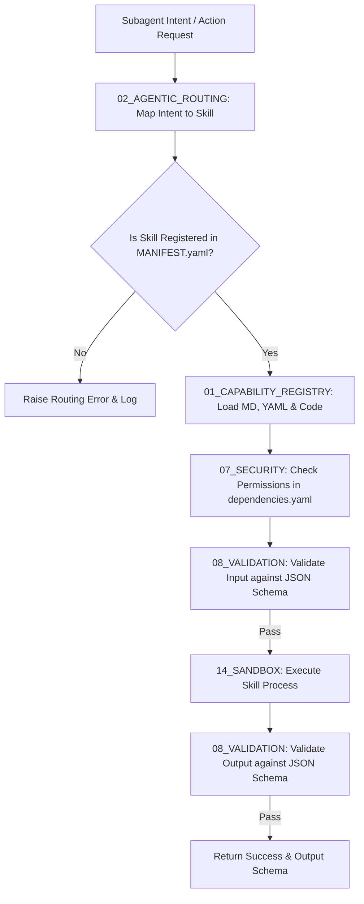

# 🛠️ Antigravity Skills System (Module 02) — Specification Document
**Version**: 1.0.0  
**Classification**: Tier 2 Operational Capabilities Layer  
**Status**: Active / Enforced  

---

## 🌌 1. Executive Summary & Purpose

The **Skills System** (`02_SKILLS`) is the stateless, reusable capability layer of the Antigravity Platform. It decouples business logic, computational routines, and tool executions from downstream subagent models. By standardizing actions into discrete "Skills," the platform ensures that agent behaviors remain purely coordinating while computational work remains deterministic, testable, and sandboxed.

All skills are registered in a central manifest and must expose strict, JSON-schema-validated input and output contracts. This allows both the coordination agents and the validation engines to verify execution safety and correctness before any code runs on the host system.

---

## 🏛️ 2. Structure & Submodules

The `02_SKILLS` directory contains the capability registry, intent routing system, and domain-specific action modules:

| Component / Submodule | Purpose & Function |
| :--- | :--- |
| **`MANIFEST.yaml`** | The central catalog registry mapping active domains to registered skills. |
| **`01_CAPABILITY_REGISTRY`** | Code hooks, loaders, and initialization scripts that dynamically load skill modules. |
| **`02_AGENTIC_ROUTING`** | The semantic router that matches a subagent's natural language intent to a registered skill. |
| **`03_SYSTEM_SKILLS`** | Platform-level tools (e.g., git staging, filesystem scanners, sandbox setup). |
| **`04_SKILL_DOMAINS`** | Categorized directories containing domain-specific skills (e.g., `ROBOTICS_ENGINEERING` skills like `cad_design`, `pcb_design`, `robotics_kinematics`). |

### Anatomy of a Skill
Every skill must reside in its own subdirectory inside a skill domain (e.g., `04_SKILL_DOMAINS/ROBOTICS_ENGINEERING/cad_design/`) and contain three mandatory files:

1. **`skill.md`**: Declares descriptive metadata and formal JSON-schema boundaries for both input and output parameters.
2. **`validation.md`**: Defines unit testing commands, verification scenarios, and pass-fail criteria for the skill.
3. **`dependencies.yaml`**: Explicitly lists necessary packages, runtimes, and file read/write permissions required by the skill.

---

## ⚙️ 3. Execution & Routing Integration Model

The Skills System interfaces with the agent loop, execution engine, and sandbox to run capabilities:

### 3.1. Intent Routing (`02_AGENTIC_ROUTING`)
- Subagents output natural language intents when requesting actions.
- The Agentic Routing sub-module maps these intents semantically to the registered skill identifiers.

### 3.2. Sandbox-Constrained Execution (`14_SANDBOX` & `07_SECURITY`)
- Before a skill runs, the system reads its `dependencies.yaml` permissions.
- The execution engine starts the process inside `14_SANDBOX` with the restricted access policies (e.g. limiting file reads/writes solely to `/sandbox`).

---

## 🛡️ 4. Operational Guardrails & Rules

1. **Absolute Statelessness**: Skills must not persist internal runtime state across calls. Any shared context must be explicitly passed through the input/output schemas or stored in the `04_MEMORY` layer.
2. **Deterministic Outputs**: For any given set of valid inputs, a skill must produce a predictable output schema or return a structured error code. Unhandled crashes are forbidden.
3. **Schema Compliance**: Both input arguments and output results are validated at runtime against the schemas in `skill.md`. If either check fails, execution halts immediately.
4. **No External Imports without Declaration**: No skill code may use libraries or external binaries that are not explicitly registered in its `dependencies.yaml`.

---

## 🔗 5. Obsidian Semantic Graph & Conventions

- **Wikilinks Structure**: All skill documentation must reference parent domains and related specifications (e.g., `[[03_SUBAGENTS/SPECIFICATION|Subagents System]]`, `[[14_SANDBOX/SPECIFICATION|Sandbox Runtime]]`).
- **Standardized Schema Links**: Every skill schema in `skill.md` must link to its verification checks in `validation.md`.
- **Obsidian Graph Visibility**: The skills are structured inside domains to compile clean hierarchical maps inside the Obsidian vault.
