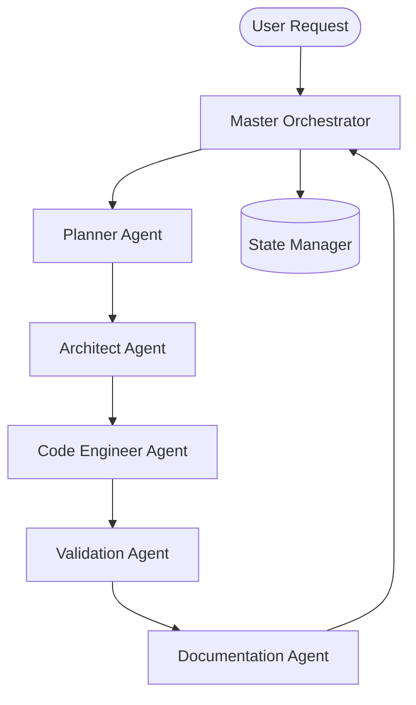

# 🤖 Module 03: Subagents System

## 🌌 Overview

The **Subagents System** implements the autonomous execution layer of the Antigravity ecosystem. Instead of a single monolithic agent, Antigravity decomposes complex project pipelines into specialized, bounded subagents. Each subagent operates on a single domain under a strict safety contract, calling stateless skills to perform technical tasks.

All agents operating in the system are governed by the [[agent_contract]].

---

## 📂 Subagents Directory Layout

The module is divided into structural kernels and categorized agent types:

*   **`00_AGENT_KERNEL/`**: Core definitions, execution schemas, and the standard behavioral contract.
    *   [[03_SUBAGENTS/00_AGENT_KERNEL/agent_contract|agent_contract.md]]: Bounded execution rules, state lifecycles, and security scopes.
    *   [[03_SUBAGENTS/00_AGENT_KERNEL/communication_protocol|communication_protocol.md]]: Schema-based communication policies.
    *   [[03_SUBAGENTS/00_AGENT_KERNEL/AGENT_LIFECYCLE|AGENT_LIFECYCLE.md]]: Dynamic spawn-to-terminate management.
*   **`01_COORDINATION_AGENTS/`**: Contains the Master Orchestrator, which coordinates the work of other agents.
*   **`02_INTELLIGENCE_AGENTS/`**: High-level reasoning and verification agents.
    *   [[architect_agent]]: System architecture, dependencies, and design.
    *   [[planner_agent]]: Milestone decomposition, project planning, and task ordering.
    *   [[validation_agent]]: Multi-layer schema, code, and security checker.
*   **`03_ENGINEERING_AGENTS/`**: Hands-on development and documentation agents.
    *   [[code_engineer_agent]]: Coding, compilation, testing, and optimization.
    *   [[documentation_agent]]: Maintenance of markdown vault, API schemas, and specifications.
*   **`04_ROBOTICS_AGENTS/`**: Domain-specific hardware and kinematics solvers.
    *   `kinematics_agent`: Inverse/forward kinematics computations.
    *   `quadruped_agent`: Gait controls and balancing profiles.
    *   `simulation_agent`: Webots/ROS2 physical simulation controller.

---

## 🏛️ Agent Collaboration Diagram

Below is the relationship map showing how specialized agents coordinate to solve a request:

---

## 🛡️ Core Safety Guardrails

1.  **Single Responsibility**: No agent may perform actions outside its capabilities domain (e.g., `code_engineer_agent` will refuse to alter the project milestones list).
2.  **State-Locked Execution**: An agent must load the current state from the State Manager, execute its tasks, output result schemas, and trigger state updates. Direct, out-of-order mutations are blocked.
3.  **Strict File Permissions**: Agents are restricted to specific directories. Modifying files in the `00_CORE_BRAIN` or `01_GLOBAL_RULES` zones is blocked by the runtime.