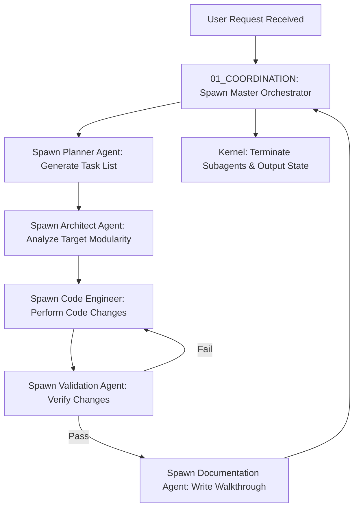

# 🤖 Antigravity Subagents System (Module 03) — Specification Document
**Version**: 1.0.0  
**Classification**: Tier 2 Operational Agents Layer  
**Status**: Active / Enforced  

---

## 🌌 1. Executive Summary & Purpose

The **Subagents System** (`03_SUBAGENTS`) provides the autonomous execution, reasoning, and coordination layers of the Antigravity Platform. Rather than relying on a single monolithic AI, the platform decomposes complex tasks (like robotics architecture, physics modeling, and testing) into specialized, domain-bounded **Subagents**. 

Every subagent acts as an independent worker governed by a strict, machine-enforced behavior contract. They perform operations by invoking stateless capabilities provided by the [[02_SKILLS/SPECIFICATION|Skills System]], communicating with each other via formal schemas, and operating under the zero-trust security limits defined by the platform core.

---

## 🏛️ 2. Structure & Agent Categories

The subagents directory is organized into a core runtime kernel and distinct functional subagent groups:

| Component / Directory | Purpose & Registered Agents |
| :--- | :--- |
| **`00_AGENT_KERNEL`** | Contains global agent policies: the `agent_contract.md`, schema-based `communication_protocol.md`, and the dynamic `AGENT_LIFECYCLE.md` coordinator. |
| **`01_COORDINATION_AGENTS`** | **Master Orchestrator**: Accepts requests, decomposes goals, spawns target subagents, tracks their progress, and compiles final deliverables. |
| **`02_INTELLIGENCE_AGENTS`** | **Architect Agent**: Manages codebase structures, dependency graphs, and architecture compliance. **Planner Agent**: Decomposes high-level requests into sequential, testable task steps. **Validation Agent**: Performs safety audits, schema checks, and static verification checks. |
| **`03_ENGINEERING_AGENTS`** | **Code Engineer Agent**: Generates, refactors, compiles, and optimizes code files. **Documentation Agent**: Generates specifications, updates user guides, and maintains the Obsidian vault. |
| **`04_ROBOTICS_AGENTS`** | Domain-specific agents: `kinematics_agent` (mathematical control solvers), `quadruped_agent` (gait and balance configuration), and `simulation_agent` (physics simulation runner). |

---

## ⚙️ 3. Integration & Agent Lifecycle Model

Subagents follow a strict event-driven lifecycle managed by the Agent Kernel and coordinated by the Master Orchestrator:

### 3.1. Schema-Based Communication (`00_AGENT_KERNEL/communication_protocol.md`)
- Subagents are forbidden from exchanging unstructured text for control decisions.
- All requests, handoffs, and feedback are transmitted via JSON-schema-validated messages.

### 3.2. Lifecycle Operations (`00_AGENT_KERNEL/AGENT_LIFECYCLE.md`)
1. **Spawn**: The Kernel instantiates a subagent, loading its configuration, setting environment boundaries, and injecting relevant context.
2. **Execute**: The subagent runs its internal reasoning loop, requesting skill executions from `02_SKILLS`.
3. **Verify**: The subagent checks its outputs against target criteria.
4. **Terminate**: The subagent frees memory, returns its output schema, and undergoes destruction.

---

## 🛡️ 4. Core Security Guardrails & Contract

Every agent is programmatically bound by the **Agent Contract** (`agent_contract.md`):

1. **Strict Directory Permissions**: Subagents can only read/write files in directories assigned to their role. Writing to `00_CORE_BRAIN` or `01_GLOBAL_RULES` is blocked at the system level.
2. **Role Boundaries**: No agent may perform actions outside its classification (e.g. the Code Engineer cannot alter planning milestones; the Planner cannot directly write code to source directories).
3. **Loop Escape Rules**: Subagents must track execution iterations. If a task fails or loops more than five times without progressing, the subagent must immediately halt and escalate to the Master Orchestrator.
4. **State-Locked Updates**: Subagents cannot modify the global system state directly. State updates must be submitted to the State Manager (`09_EXECUTION_ENGINE/05_STATE_MANAGER`) as atomic state transitions.

---

## 🔗 5. Obsidian Semantic Graph & Conventions

- **Bidirectional Backlinks**: Every agent file must contain backlinks pointing to its specific capabilities in `02_SKILLS` and its rules of engagement in `01_GLOBAL_RULES`.
- **System Graph**: Agents are indexed dynamically into the Obsidian vault to compile active collaboration maps.
- **GFM Formatting**: All logs and configuration templates must use standard GFM formats for easy parsing.
