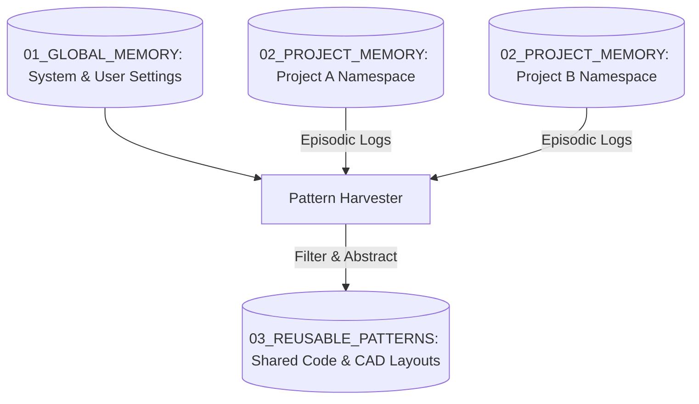
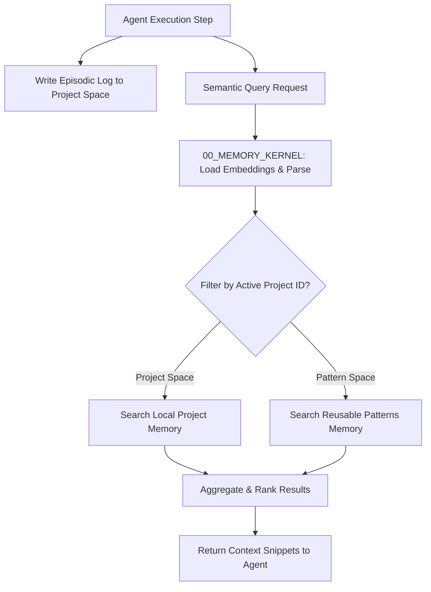

# 🧠 Antigravity Memory OS (Module 04) — Specification Document
**Version**: 1.0.0  
**Classification**: Tier 2 Operational Memory Layer  
**Status**: Active / Enforced  

---

## 🌌 1. Executive Summary & Purpose

The **Memory OS** (`04_MEMORY`) is the persistent knowledge management, experience storage, and semantic indexing system of the Antigravity Platform. By structuring execution experience into discrete memory segments, caching reusable engineering patterns, and enforcing strict project context isolation, the Memory OS enables agents to learn from historical runs, optimize repetitive operations, and prevent cross-project context leakage.

The memory architecture is designed to prevent context bloat in agent prompts while providing low-latency, relevant recall of codebase structures, historical execution logs, and validated engineering patterns.

---

## 🏛️ 2. Structure & Segmentation Strategy

The `04_MEMORY` directory is split into core indexing algorithms and isolated namespace storage zones:

| Component / Submodule | Purpose & Contents |
| :--- | :--- |
| **`00_MEMORY_KERNEL`** | Core databases, semantic indexing scripts, embedding models, and query loaders. Holds `MEMORY_ARCHITECTURE.md`. |
| **`01_GLOBAL_MEMORY`** | Shared environment configurations, global execution summaries, user preferences, and cross-project statistics. |
| **`02_PROJECT_MEMORY`** | Project-specific snapshots, execution task steps, local variables, and codebase metrics. |
| **`03_REUSABLE_PATTERNS`** | Curated database of verified code implementations, CAD layouts, troubleshooting logs, and optimization guidelines. |
| **`MEMORY_SEGMENTATION_POLICY.md`** | Governing policies for data segregation, namespace structures, and privacy. |

### The Segregated Database Model
Memory is structurally separated to prevent cross-contamination of project contexts:

- **Project Namespace Isolation**: Project A's execution context is strictly barred from reading or querying database files inside Project B's namespace directory.
- **Decoupled Vector Search**: Vector indexes are partitioned using strict metadata tags. Search queries originating from a subagent working on a specific project are scoped only to that project's space.

---

## ⚙️ 3. Integration & Memory Operations

Memory OS exposes standard retrieval and storage API endpoints to the platform:

### 3.1. Episodic Step Recording
- As subagents execute tasks, they append step-level execution records to `02_PROJECT_MEMORY/<project_id>/episodic_logs.jsonl`.
- These logs are analyzed by the Validation Engine to trace task status and generate recovery states during rollbacks.

### 3.2. Pattern Harvesting
- Successful task executions that introduce new, validated solutions (e.g. solving a specific Webots simulation crash or configuring a motor control loop) trigger the pattern harvester.
- The harvester abstracts the concrete parameters and stores the solution inside `03_REUSABLE_PATTERNS`.

---

## 🛡️ 4. Core Memory Guardrails

1. **Namespace Boundary Checks**: Any memory query or write operation must include a validated `project_id`. Attempts to access files outside the namespace corresponding to the active project will fail validation.
2. **Context Bloat Mitigation (Pruning Policy)**: Raw episodic logs older than 30 days are automatically summarized, compressed, and archived. The original logs are pruned from memory to maintain optimal context window utilization.
3. **Immutable Pattern Registry**: Files in `03_REUSABLE_PATTERNS` are read-only for standard subagents. Only the Master Orchestrator, after a successful validation run, is authorized to write to this namespace.
4. **Secret Filtering**: Before storing any execution log in project or global memory, the memory writer runs regex checks to detect and strip passwords, API keys, and private tokens.

---

## 🔗 5. Obsidian Semantic Graph & Conventions

- **Double-Bracket Linking**: Memory summaries must link back to their originating project folders (e.g., `[[10_PROJECT_INTELLIGENCE/SPECIFICATION|Project Registry]]`).
- **Standardized Metadata**: Every memory block is formatted as Markdown with a YAML frontmatter block containing tags, project association, and timestamp data.
- **Graph Indexing**: Memory nodes are structured to allow clean semantic traversal of code patterns inside the Obsidian graph viewer.
