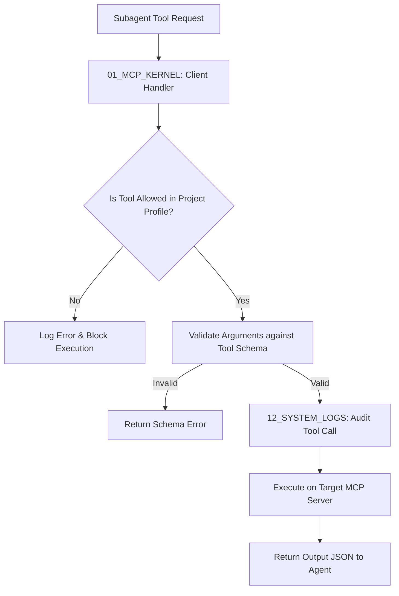

# 🔌 Antigravity Model Context Protocol (Module 05) — Specification Document
**Version**: 1.0.0  
**Classification**: Tier 2 Operational Connectors Layer  
**Status**: Active / Enforced  

---

## 🌌 1. Executive Summary & Purpose

The **Model Context Protocol (MCP)** module (`05_MCP`) is the standardized connector framework of the Antigravity Platform. It establishes a secure, protocol-based interface between downstream LLM-driven subagents and local execution environments (including file systems, database adapters, command executors, and physical simulators). 

Rather than writing custom, non-standard API integrations for every task and tool, Antigravity uses MCP to define tools as self-documenting, schema-validated services. This decouples agent implementation from technical tool APIs, enforcing unified access controls, request validation, and comprehensive audit logs across all system interactions.

---

## 🏛️ 2. Structure & Directory Layout

The `05_MCP` directory contains the connection engine, standard protocol integrations, proprietary servers, and runtime profile configurations:

| Component / Submodule | Purpose & Contents |
| :--- | :--- |
| **`01_MCP_KERNEL`** | Core protocol handlers, client connection managers, and security enforcement engines. Contains the `MCP_INTEGRATION_GUIDE.md` and the `MCP_SECURITY_MODEL.md`. |
| **`02_STANDARD_MCPS`** | Integrations for standard community-developed MCP servers (e.g. SQLite database connectors, browser runners, file search utilities). |
| **`03_CUSTOM_MCPS`** | Proprietary, in-house servers developed specifically for robotics engineering (e.g. CAD parser tools, kinematics converters, motor profile calculators). |
| **`04_PROJECT_MCP_PROFILES`** | Configuration files declaring which servers, tools, and resource endpoints are active for specific project workspaces. |

---

## ⚙️ 3. Execution & Routing Integration Model

MCP connects agents, clients, and servers through a pipeline containing security and validation steps:

### 3.1. Schema-First Tool Discovery
- At system startup, the MCP Kernel establishes connections with the servers registered in the active `PROJECT_MCP_PROFILE`.
- The client queries each server for its exposed tool definitions and JSON schemas.
- These schemas are dynamically loaded and registered with the Validation Engine (`08_VALIDATION`) and the subagents.

### 3.2. Unified Audit Trails
- All calls, input arguments, execution latencies, and output payloads are serialized and piped directly to the system audit logger (`12_SYSTEM_LOGS`).
- This ensures full traceability of all filesystem and system modifications.

---

## 🛡️ 4. Core Security Guardrails & Policies

Every MCP connection must comply with the policies defined in the `MCP_SECURITY_MODEL.md`:

1. **Least-Privilege Routing**: Subagents are blocked from executing tools that are not declared in their active project configuration profiles.
2. **Strict Sandbox Boundaries**: Custom and standard MCP servers executing commands on the host must run inside the boundaries of `14_SANDBOX`. Direct, unconstrained shell access is prohibited.
3. **No Credential Exposure**: Authentication keys required by external MCP services (e.g. databases, cloud API gateways) must be dynamically injected via environment variables using `17_SECRETS` rather than hardcoded in server profiles.
4. **Rate and Payload Limits**: Requests to MCP servers are governed by rate-limiting rules. Payloads exceeding 5MB are automatically blocked to prevent memory crashes.

---

## 🔗 5. Obsidian Semantic Graph & Conventions

- **Standard Vault References**: Documentation in this module must link back to governance rule files (e.g. `[[01_GLOBAL_RULES/SPECIFICATION|Global Rules]]`, `[[07_SECURITY/SPECIFICATION|Security Engine]]`).
- **Integration Documents**: New custom servers must include a `README.md` linked to the central `[[05_MCP/01_MCP_KERNEL/MCP_INTEGRATION_GUIDE|MCP Integration Guide]]` to maintain consistent documentation.
- **Graph Metadata**: Dynamic server configurations are represented as config files and indexed as system configuration nodes.
