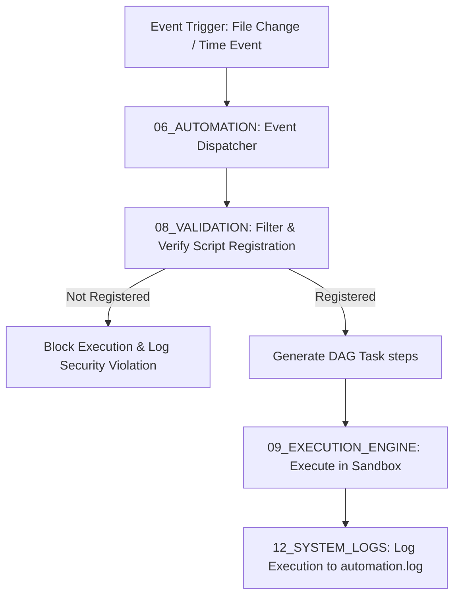

# 🤖 Antigravity Automation System (Module 06) — Specification Document
**Version**: 1.0.0  
**Classification**: Tier 3 Infrastructure Layer  
**Status**: Active / Enforced  

---

## 🌌 1. Executive Summary & Purpose

The **Automation Module** (`06_AUTOMATION`) is the event-driven execution coordinator and background scheduling engine of the Antigravity Platform. It automates operational workflows—such as continuous validation checks, automated workspace builds, project index updates, and background cleanup scripts—without requiring active human intervention.

By integrating file-system watchers and cron-like schedulers, this module provides the active feedback loop of the platform, ensuring the workspace stays compliant with the [[01_GLOBAL_RULES/SPECIFICATION|Global Rules]] and that state is synchronized in the background.

---

## 🏛️ 2. Structure & Directory Layout

The `06_AUTOMATION` directory contains event triggers, cron configurations, and workflow execution frameworks:

| Component / Submodule | Purpose & Contents |
| :--- | :--- |
| **`01_WORKFLOWS`** | Defines event-triggered pipelines (e.g. executing checks on file edits, compiling CAD specs on saving model files). Contains the `AUTOMATION_FRAMEWORK.md` spec. |
| **`02_CRON_JOBS`** | Configures time-based schedules (e.g. nightly backup snapshots, database optimization, log compression routines). |

### The Event-Handler Model
Automation tasks are processed through a structured pipeline to ensure safety and prevent loops:

---

## ⚙️ 3. Execution & Workflow Integration

The Automation module coordinates events and schedules with the core execution pipeline:

### 3.1. File System Watchers (Event-Driven Execution)
- The automation dispatcher uses directory watchers (e.g., node-based file monitors) configured to monitor active project directories.
- File system changes (creation, modification, deletion) generate events that are parsed, matched against active triggers in `01_WORKFLOWS`, and dispatched to the validator.

### 3.2. Scheduled Job Dispatch (Time-Based Execution)
- The cron daemon runs as a background process, checking for scheduled job triggers in `02_CRON_JOBS`.
- When a cron expression matches the system clock, the scheduler dispatches the associated maintenance task to the execution engine.

---

## 🛡️ 4. Core Safety Guardrails

1. **Strict Script Registration**: Only scripts explicitly registered in the automation manifest and validated by the security manager can be executed. Dynamic code execution of unverified scripts is blocked.
2. **Infinite Loop Prevention**: Schedulers track consecutive trigger events on the same file paths. If a path triggers more than three executions within a 30-second window, the dispatcher pauses automation for that path and alerts the Master Orchestrator.
3. **Sandbox Enforcement**: All automated workflows are executed inside `14_SANDBOX` with restricted permissions. They are blocked from accessing raw host directories or writing to write-protected zones.
4. **Log Redundancy**: The stdout, stderr, and execution metadata of all automation runs are logged to `12_SYSTEM_LOGS/automation.log`.

---

## 🔗 5. Obsidian Semantic Graph & Conventions

- **Document Connections**: Automation specifications link back to execution engine specs (e.g., `[[09_EXECUTION_ENGINE/SPECIFICATION|Execution Engine]]`, `[[12_SYSTEM_LOGS/SPECIFICATION|System Logs]]`).
- **YAML Formatting**: All automation configuration parameters in `01_WORKFLOWS` are formatted in clean YAML blocks.
- **Backlinks**: Custom workflows reference the specific files and folders they monitor, showing active links in the Obsidian graph.
