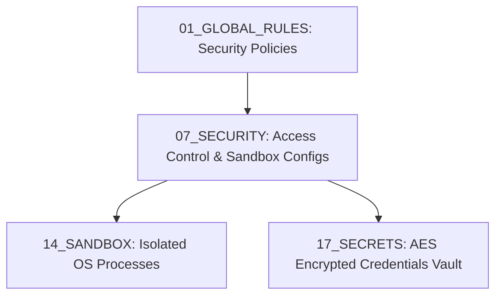
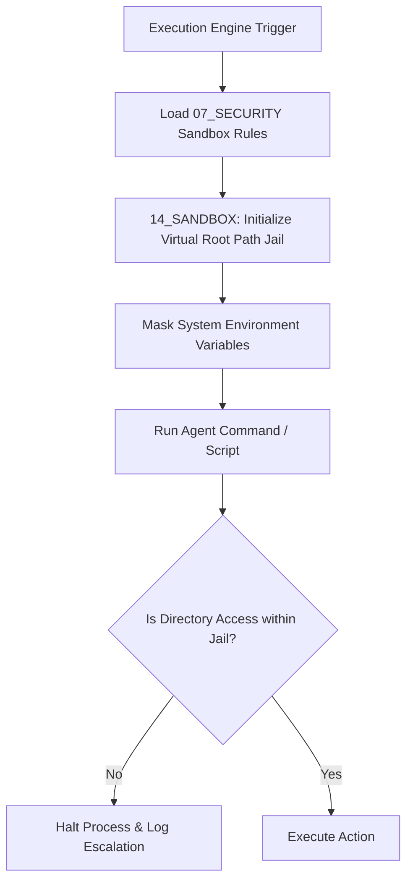

# 🔒 Antigravity Security System (Module 07) — Specification Document
**Version**: 1.0.0  
**Classification**: Tier 3 Infrastructure Security Layer  
**Status**: Active / Enforced  

---

## 🌌 1. Executive Summary & Purpose

The **Security Module** (`07_SECURITY`) enforces the zero-trust security paradigm of the Antigravity Platform. It acts as the gatekeeper for all interactions between the host system and the operational capabilities layer. Its primary goals are to guarantee host protection, enforce role-based access control (RBAC), prevent execution escapes, and protect system secrets from leaking into agent histories.

By implementing strict path jails, network filters, and environment variables masking, this module guarantees that unverified or malfunctioning subagents cannot perform malicious or destructive actions.

---

## 🏛️ 2. Structure & Security Hierarchy

The `07_SECURITY` directory contains policies, role definitions, and sandbox configuration rules:

| Component / Submodule | Purpose & Contents |
| :--- | :--- |
| **`01_POLICIES`** | Role-based mappings, subagent permissions, and hardware interface bindings. Contains the `ACCESS_CONTROL.md` specification. |
| **`02_SANDBOX_RULES`** | Filesystem path jails, network socket restrictions, and environment variable masking policies. Contains the `SANDBOX_RULES.md` specification. |

### The Security Control Hierarchy
General security laws are translated down into technical runtime enforcements:

### Access Control Model (from `ACCESS_CONTROL.md`)
The system enforces a 3-tier access classification structure:
1. **Public Zone**: Non-sensitive files, open documentation, and general guides. Readable by all subagents.
2. **Private Zone**: Active project files, memory snapshots, and custom skills code. Access restricted to authorized subagents working on that project.
3. **Critical Zone**: Platform core directories (`00_CORE_BRAIN`, `01_GLOBAL_RULES`, `07_SECURITY`, `17_SECRETS`). Read-only for verification; write-blocked for all agents.

---

## ⚙️ 3. Integration & Enforcement Model

Security policies are actively compiled and enforced at runtime:

### 3.1. Path Jailing
- The Sandbox rules restrict filesystem access using virtual root directory policies.
- Execution steps are barred from referencing directories above the active workspace or sandbox directories (e.g. using `..` to traverse paths).

### 3.2. Environment Variable Masking
- The Security module strips sensitive host system variables (like user logins, system path registries, and host credentials) before spawning any child process, replacing them with virtual workspace variables.

---

## 🛡️ 4. Core Security Guardrails

1. **Zero-Trust Defaults**: All capabilities are locked by default. Subagents must explicitly declare required permissions in `permissions.yaml` configurations, which are verified against the access control registry.
2. **Execution Blockage**: Any write attempt targeting critical directories (`00_CORE_BRAIN`, `01_GLOBAL_RULES`, etc.) triggers a security violation event, causing the execution manager to terminate the current task loop and rollback modifications.
3. **Network Isolation**: Direct raw socket creation or unverified HTTP requests are blocked unless explicitly configured in the project profile.
4. **Secrets Injection**: System and API credentials must never be written to files. Verification routines ensure secret values are injected purely in-memory at execution runtime using `17_SECRETS`.

---

## 🔗 5. Obsidian Semantic Graph & Conventions

- **Graph Linking**: Links point back to the runtime execution modules (e.g., `[[14_SANDBOX/SPECIFICATION|Sandbox Runtime]]`, `[[17_SECRETS/SPECIFICATION|Secrets Vault]]`).
- **Policy Identifiers**: Every logged security event references a specific rule ID from `07_SECURITY/01_POLICIES/ACCESS_CONTROL.md`.
- **Obsidian Graph Security Maps**: Shows active dependencies between roles, permissions, and subagents.
