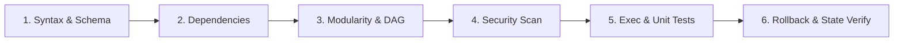
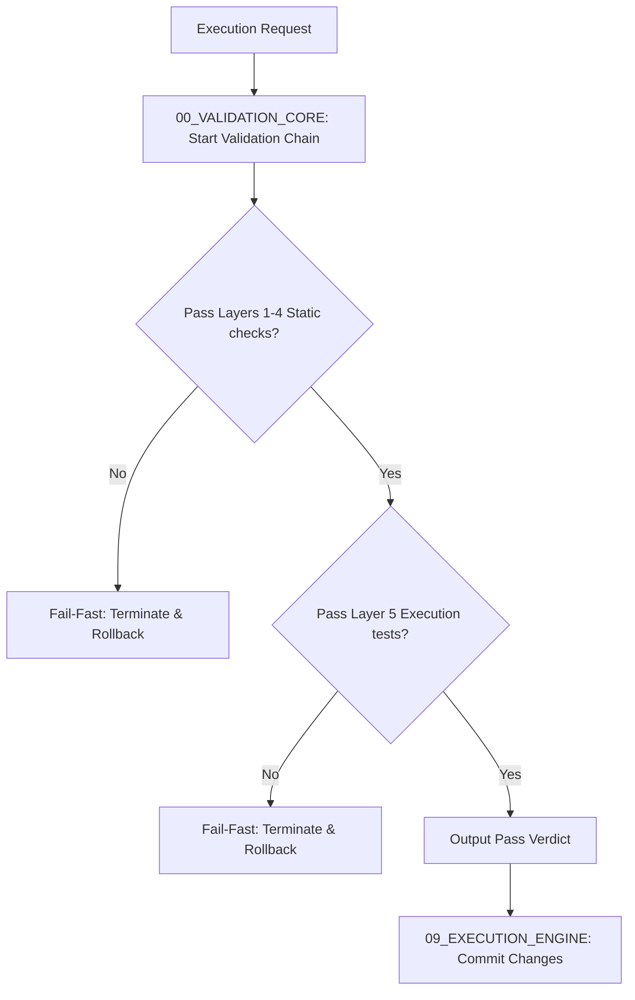

# 🚦 Antigravity Validation Engine (Module 08) — Specification Document
**Version**: 1.0.0  
**Classification**: Tier 3 Infrastructure Validation Layer  
**Status**: Active / Enforced  

---

## 🌌 1. Executive Summary & Purpose

The **Validation Module** (`08_VALIDATION`) is the primary compliance, quality gate, and static analysis engine of the Antigravity Platform. Sitting at **Tier 3 (Infrastructure)**, it acts as a gatekeeper that verifies all code changes, tool arguments, project configurations, and execution graphs prior to committing changes to the project workspace or executing them.

By running a standardized, multi-layered check sequence, the validation engine prevents broken code, security violations, and dependency cycles from entering the system repository, maintaining the overall reliability and modularity of the workspace.

---

## 🏛️ 2. Structure & Directory Layout

The `08_VALIDATION` directory contains the core pipeline checker and specialized validation libraries for specific domains:

| Component / Submodule | Purpose & Contents |
| :--- | :--- |
| **`00_VALIDATION_CORE`** | The main validation scheduler, parser adapters, and execution gate coordinator. Contains the `VALIDATION_PIPELINE.md` specification. |
| **`10_ROBOTICS_VALIDATION`** | Domain-specific parsers verifying robotics data (e.g. trajectory coordinate tables, CAD mechanical mesh constraints, PCB connection graphs, control loop properties). |

### The 6-Layer Validation Chain
Every task step must satisfy the checks across all six operational validation layers:

1. **Syntax & Schema**: Validates files (JSON, YAML, MD, JS) for syntax syntax correctness and verifies parameters against declared JSON schemas.
2. **Dependencies**: Verifies that declared package dependencies and platform capabilities are available.
3. **Modularity & DAG**: Analyzes the import graphs to ensure they form a Directed Acyclic Graph (DAG) and adhere to platform module boundaries.
4. **Security Scan**: Runs static analysis scanning for hardcoded secrets, unauthorized shell commands, and sandbox boundary violations.
5. **Execution & Unit Tests**: Executes unit test suites and validates outputs inside `14_SANDBOX`.
6. **Rollback & State Verify**: In case of a check failure in prior layers, triggers recovery routines (`15_RECOVERY`) to clean up files and restore the workspace.

---

## ⚙️ 3. Integration & Operational Flow

The Validation Engine sits between intent routing and final state commitments:

### 3.1. Fail-Fast Execution
- The pipeline uses a fail-fast strategy. If any check fails (e.g., a syntax error in Layer 1), the validator terminates the check loop immediately.
- This prevents downstream execution stages from running on bad code, saving computing cycles and preventing state degradation.

### 3.2. Detailed Logging
- Detailed results, including check durations, files analyzed, lint messages, and exact failure lines, are written to `12_SYSTEM_LOGS/validation_checks.log`.

---

## 🛡️ 4. Core Validation Rules

1. **Mandatory Pass**: No state modification task is committed to the workspace until the Validation Engine yields a final `PASS` verdict.
2. **Strict Import Check**: Static analysis must check all modified code files. Imports crossing layer boundaries upwards (e.g., a Support module importing a Governance module) are rejected.
3. **Regex Secrets Verification**: Files are scanned using high-entropy search regexes to block credentials from being committed.
4. **Isolated Run Test**: Layer 5 unit tests must run inside the sandbox. Tests requesting raw host execution are flagged and blocked.

---

## 🔗 5. Obsidian Semantic Graph & Conventions

- **Semantic Vault Connections**: The validator links directly to global policy documents (e.g., `[[01_GLOBAL_RULES/SPECIFICATION|Global Rules]]`, `[[09_EXECUTION_ENGINE/SPECIFICATION|Execution Engine]]`).
- **Standardized Log Backlinks**: Logs generated in `validation_checks.log` contain Obsidian-compatible links pointing directly to the files that triggered errors.
- **Verification Visualization**: Checks status maps are structured to allow dashboard parsing and graphing.
