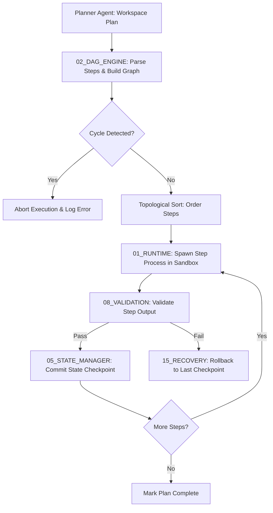

# ⚙️ Antigravity Execution Engine (Module 09) — Specification Document
**Version**: 1.0.0  
**Classification**: Tier 3 Infrastructure Orchestration Layer  
**Status**: Active / Enforced  

---

## 🌌 1. Executive Summary & Purpose

The **Execution Engine** (`09_EXECUTION_ENGINE`) is the primary runtime orchestrator, task scheduler, and state synchronization core of the Antigravity Platform. It translates high-level agent plans into concrete Directed Acyclic Graphs (DAGs), sorts them topologically, manages process spawns inside sandboxed slots, and coordinates atomic state transactions.

The engine ensures that all executions are deterministic, ordered, and fault-tolerant by providing checkpointing and automatic rollbacks whenever a step in the pipeline fails verification.

---

## 🏛️ 2. Structure & Submodules

The `09_EXECUTION_ENGINE` directory consists of runtime environments, DAG scheduling components, and state management systems:

| Component / Submodule | Purpose & Contents |
| :--- | :--- |
| **`01_RUNTIME`** | Handles step-level process spawns, log streaming, timeout constraints, and OS signals inside the sandbox. Holds `RUNTIME_PROTOCOL.md`. |
| **`02_DAG_ENGINE`** | Builds execution graphs, checks for cyclic dependencies, and generates topological schedules. Holds `DAG_ENGINE_SPEC.md`. |
| **`05_STATE_MANAGER`** | Manages transactional commits to database states, updates active project variables, and tracks state history. Holds `STATE_MANAGEMENT.md`. |

---

## ⚙️ 3. Execution & Transactional Commits

The Execution Engine coordinates work through a topological graph solver and transactional state manager:

### 3.1. Topological Execution Scheduling
- The DAG Engine processes step node arrays. It checks for cycles using Depth-First Search (DFS) algorithms.
- Once verified as acyclic, nodes are sorted topologically to construct the final execution pipeline.
- Independent paths are scheduled for parallel execution in separate sandbox processes.

### 3.2. Checkpointed State Commits (`05_STATE_MANAGER`)
- State mutations are transactional. A change is never directly written to the global system registry.
- When a task step succeeds, a state diff checkpoint is compiled and committed to the database log file.
- If a downstream node crashes, the recovery system reads the previous checkpoint and reverts the files.

---

## 🛡️ 4. Core Execution Guardrails

1. **Strict Dependency Order**: A step cannot execute until all its parent nodes in the DAG have successfully completed and passed validation checks.
2. **Process Timeout Limits**: Every sandbox process is assigned a maximum timeout (default 5 minutes). Processes exceeding the limit are killed to prevent hanging resources.
3. **No Direct Writes**: Direct state mutations bypassing the State Manager API are blocked. Subagents must submit mutation diff packages for validation and commit.
4. **Isolate Processes**: Parallel execution slots inside `14_SANDBOX` are namespace-isolated and run in separate processes to prevent CPU/memory conflicts.

---

## 🔗 5. Obsidian Semantic Graph & Conventions

- **Semantic Vault Connections**: Links back to active checkers and safety runners (e.g., `[[08_VALIDATION/SPECIFICATION|Validation Engine]]`, `[[14_SANDBOX/SPECIFICATION|Sandbox Runtime]]`, `[[15_RECOVERY/SPECIFICATION|Recovery System]]`).
- **Standardized Code Mappings**: Every execution node in the DAG is associated with a specific task ID mapped in `task.md`.
- **Graph Tracking**: State changes and execution checkpoints are recorded as nodes in the global graph database.
