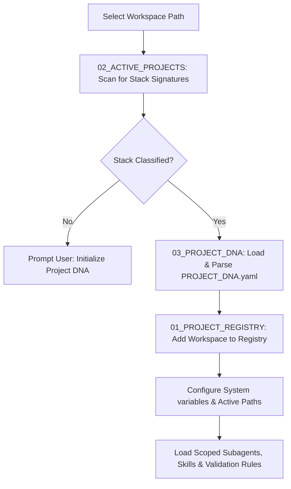

# 🪐 Antigravity Project Intelligence (Module 10) — Specification Document
**Version**: 1.0.0  
**Classification**: Tier 3 Infrastructure Intelligence Layer  
**Status**: Active / Enforced  

---

## 🌌 1. Executive Summary & Purpose

The **Project Intelligence Module** (`10_PROJECT_INTELLIGENCE`) is the project categorization, environment classification, and workspace metadata parser of the Antigravity Platform. It automatically scans directories, analyzes project stacks, registers active workspaces, and parses project-specific **Project DNA** configurations. 

This module allows the platform to adapt its rules, activate specialized subagents, and load domain-specific skills (e.g. ROS2 controllers or CAD parsers) based on the structural files found inside target project workspaces.

---

## 🏛️ 2. Structure & Directory Layout

The `10_PROJECT_INTELLIGENCE` directory contains project registers, environment detectors, and dna templates:

| Component / Submodule | Purpose & Contents |
| :--- | :--- |
| **`01_PROJECT_REGISTRY`** | Master catalogue registry tracking all workspaces, location paths, stack types, and project descriptions. |
| **`02_ACTIVE_PROJECTS`** | Active context directories containing current run flags, connection port sockets, and relative paths. Holds `PROJECT_DETECTION.md`. |
| **`03_PROJECT_DNA`** | Contains specifications, schemas, and template generators for `PROJECT_DNA.yaml` files. Holds `PROJECT_DNA_SPEC.md`. |

---

## ⚙️ 3. Integration & Dynamic Loading Model

Project Intelligence manages the workspace lifecycle through a multi-stage classification pipeline:

### 3.1. Stack Detection (`PROJECT_DETECTION.md`)
- The workspace scanner analyzes directories for stack signature files:
  - `package.json` $\rightarrow$ Node.js Stack
  - `requirements.txt` / `pyproject.toml` $\rightarrow$ Python Stack
  - `CMakeLists.txt` / `package.xml` $\rightarrow$ ROS2 C++ / Python Stack
- Stacks are mapped to domains (e.g., `robotics_engineering`, `simulation`).

### 3.2. Project DNA parsing (`PROJECT_DNA_SPEC.md`)
- The system reads the local `PROJECT_DNA.yaml` configuration to load project variables:
  - Active subagents constraints.
  - Required skills and MCP servers.
  - Security levels (strict sandboxing, sandbox-with-network, etc.).
  - Validation threshold levels.

---

## 🛡️ 4. Core Project Guardrails

1. **Mandatory Registry Mapping**: No execution can be run on a workspace directory until it has been scanned, classified, and registered in `01_PROJECT_REGISTRY`.
2. **Invalid DNA Halt**: If a `PROJECT_DNA.yaml` contains parsing syntax errors or fails validation check schemas, the loading pipeline terminates, blocking execution.
3. **Write Protection on DNA Templates**: The master DNA schema and schemas located in `03_PROJECT_DNA` are read-only and write-locked for agents.
4. **Clean Workspace Isolation**: Dynamic updates to active path variables are verified against the path jail policies of `07_SECURITY` to prevent agent workspace directory escaping.

---

## 🔗 5. Obsidian Semantic Graph & Conventions

- **Semantic Vault Connections**: Links point to system memory and rules engines (e.g., `[[01_GLOBAL_RULES/SPECIFICATION|Global Rules]]`, `[[04_MEMORY/SPECIFICATION|Memory OS]]`, `[[05_MCP/SPECIFICATION|MCP Connectors]]`).
- **Obsidian Graph Integration**: Shows files linked dynamically to their stack domains.
- **DNA Templates**: Uses GFM tables and markdown tabs to show DNA syntax schemas clearly.
