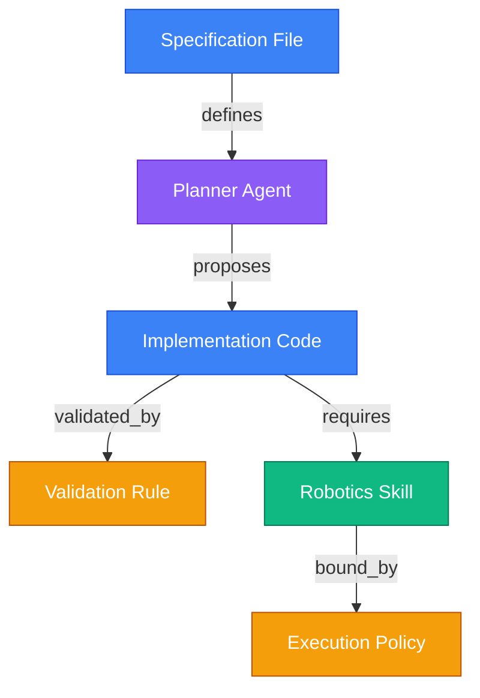

# 🕸️ Module 11: Knowledge Graph

## 🌌 Overview

The **Knowledge Graph** represents relationships between files, agents, skills, execution histories, and system rules. By connecting documents semantically, the Knowledge Graph helps agents trace code requirements back to specifications, discover relevant skills, analyze project dependencies, and optimize context queries.

---

## 📂 Knowledge Graph Directory Layout

The module contains the core database files, query scripts, and schema layouts:

*   **`01_GRAPH_CORE/`**: The core graph database files (e.g. SQLite graph tables, JSON-LD, or graph indices).
    *   [[11_KNOWLEDGE_GRAPH/01_GRAPH_CORE/GRAPH_SCHEMA|GRAPH_SCHEMA.md]]: Node properties, edge tags, and indexing strategies.
*   **`KNOWLEDGE_GRAPH_SPEC.md`**: Technical specification of the graph querying API, visualization plans, and sync workers.

---

## 🕸️ Relationship Topology

The graph connects different entities across the system:

