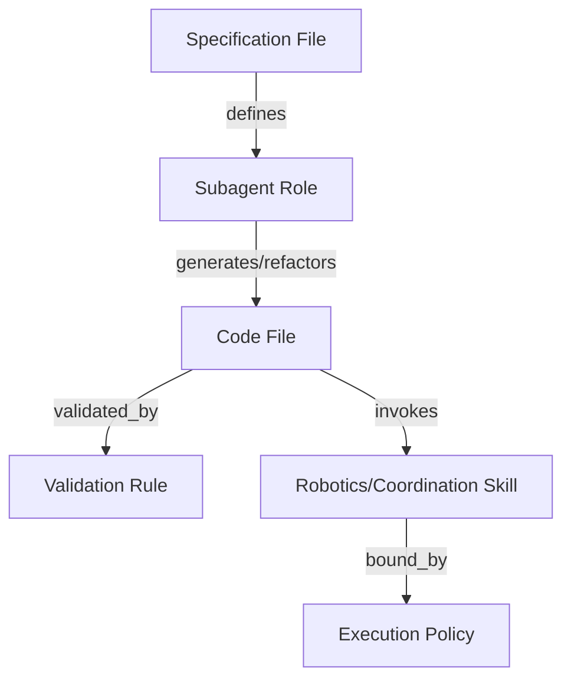
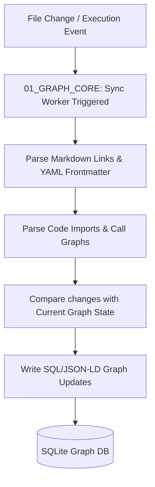

# 🕸️ Antigravity Knowledge Graph (Module 11) — Specification Document
**Version**: 1.0.0  
**Classification**: Tier 3 Infrastructure Graph Layer  
**Status**: Active / Enforced  

---

## 🌌 1. Executive Summary & Purpose

The **Knowledge Graph Module** (`11_KNOWLEDGE_GRAPH`) is the semantic relationship database, entity mapper, and context-linking engine of the Antigravity Platform. It maps, links, and indexes relationships between markdown specifications, implementation code files, subagents, skills, execution histories, and system rules.

By maintaining a unified network of semantic connections, this module enables subagents to trace dependencies, map execution paths, locate relevant skills, and retrieve highly relevant context snippets for any engineering task.

---

## 🏛️ 2. Structure & Relationship Topology

The `11_KNOWLEDGE_GRAPH` directory contains the database index cores, query schemas, and schema definitions:

| Component / Submodule | Purpose & Contents |
| :--- | :--- |
| **`01_GRAPH_CORE`** | The core database files (e.g. SQLite database indexes, RDF/JSON-LD serialization files). Contains the `GRAPH_SCHEMA.md` specification. |
| **`KNOWLEDGE_GRAPH_SPEC.md`** | Details the graph search APIs, sync scripts, and visualization formats. |

### The System Entity Topology
The graph connects multiple entity classes to form an active knowledge network:

- **Node Classifications**: Nodes represent Files, Agents, Skills, Rules, and Execution steps.
- **Edge Associations**: Edges represent properties (e.g. `defines`, `requires`, `validated_by`, `imports`, `executes`).

---

## ⚙️ 3. Integration & Sync Model

The Knowledge Graph remains updated and queryable through continuous synchronization:

### 3.1. Parsing Markdown & Obsidian Wikilinks
- The sync worker parses Obsidian double-bracket backlinks (e.g., `[[00_CORE_BRAIN/SPECIFICATION|Core Brain]]`) to build relationship edges between documents.
- Frontmatter tags (e.g., `#category`, `#status`) are extracted and stored as node attributes.

### 3.2. AST Analysis of Code Imports
- Static analysis workers extract AST (Abstract Syntax Tree) import graphs from javascript/python files, mapping code dependencies as directory-level relationship networks.

---

## 🛡️ 4. Core Graph Guardrails

1. **Transactional Syncs**: Updates to the graph are transactional. Fails in the sync worker trigger immediate rollbacks, preserving database stability.
2. **Namespace Segregation**: Just like memory, graph indexes are segregated using project-specific scopes to prevent project metadata cross-leakage.
3. **Circular Reference Alert**: If the graph engine detects dependency cycles inside workspace code imports, it raises warnings to the Validation Engine (`08_VALIDATION`).
4. **Log Redundancy**: Details of graph scans, node creations, and indexing errors are output to `12_SYSTEM_LOGS/knowledge_graph.log`.

---

## 🔗 5. Obsidian Semantic Graph & Conventions

- **Obsidian Graph Compatibility**: Node schemas match Obsidian link formats to compile beautiful semantic vaults.
- **Backlink Tracing**: Agents can run graph queries to find all specs that depend on a specific code file, ensuring clean impact analyses during updates.
- **GFM Formatting**: Mermaid charts and markdown tables are used to show relationship schemas clearly.
