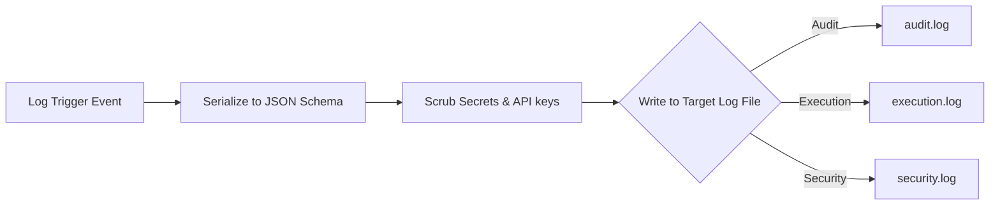

# 📝 Antigravity System Logs (Module 12) — Specification Document
**Version**: 1.0.0  
**Classification**: Tier 4 System Support Layer  
**Status**: Active / Enforced  

---

## 🌌 1. Executive Summary & Purpose

The **System Logs Module** (`12_SYSTEM_LOGS`) is the unified execution telemetry, audit trail, and operational monitoring system of the Antigravity Platform. It records and manages log files across different domains (Audit, Execution, Security, Recovery, and Validation).

By enforcing append-only policies, structured JSON layouts, and automated data-scrubbing patterns, this module ensures full execution traceability for debugging, linter reviews, and diagnostic audits.

---

## 🏛️ 2. Structure & Log Classifications

The `12_SYSTEM_LOGS` directory contains log files, protocols, and rotation engines:

| Component / Submodule | Purpose & Contents |
| :--- | :--- |
| **`LOGGING_PROTOCOL.md`** | Defines log message schemas, level mappings, and log file rotation parameters. |
| **`audit.log`** | Append-only transaction log recording high-level subagent task starts, completions, and state changes. |
| **`execution.log`** | Runtime logs containing sandbox stdout/stderr traces, processing times, and timeout signals. |
| **`security.log`** | Specific logs detailing access boundary violations, unauthorized path requests, and secret retrieval events. |

### The Logging Pipeline
Log messages are piped through filters to ensure safety and standardization:

---

## ⚙️ 3. Integration & Operational Protocols

System Logs provides continuous tracing capabilities to other support and engine modules:

### 3.1. Log Serializer Schema (`LOGGING_PROTOCOL.md`)
- Log entries are written as single-line JSON objects (JSONL) containing:
  - `timestamp`: UTC ISO 8601 string.
  - `level`: `INFO`, `WARNING`, `ERROR`, `CRITICAL`.
  - `module_id`: Target module (e.g. `03_SUBAGENTS`).
  - `task_id`: Unique identifier referencing the active checklist step.
  - `message`: Detailed description of the event.
  - `context`: Structured key-value properties.

### 3.2. Automated Log Rotation
- The logging daemon monitors file sizes.
- Logs exceeding 10MB are rotated (compressed to `.gz` format) up to a maximum of 5 historical archives.

---

## 🛡️ 4. Core Logging Guardrails

1. **Immutable Append-Only Writes**: System log files are write-append only. Editing or deleting existing lines in log files is strictly blocked by the runtime.
2. **Secrets Scrubbing Filter**: The log writer runs high-entropy regex scans on all logs. If passwords, authorization headers, or private keys are detected, they are replaced with `[REDACTED]` prior to writing.
3. **Traceability**: All downstream subagent actions must emit logs detailing their originating `task_id` to ensure audit trails remain fully linked.
4. **Log Retention Limits**: Archives are retained for 90 days. Older logs are pruned by cleanup workers.

---

## 🔗 5. Obsidian Semantic Graph & Conventions

- **Semantic Vault Connections**: Links back to execution and security modules (e.g., `[[07_SECURITY/SPECIFICATION|Security Engine]]`, `[[09_EXECUTION_ENGINE/SPECIFICATION|Execution Engine]]`).
- **Markdown Traces**: Error messages in the dashboard map directly to file paths using double-bracket Obsidian backlinks for easy debugging.
- **GFM Formatting**: Logs schemas and formatting guidelines are presented in clean tables.
