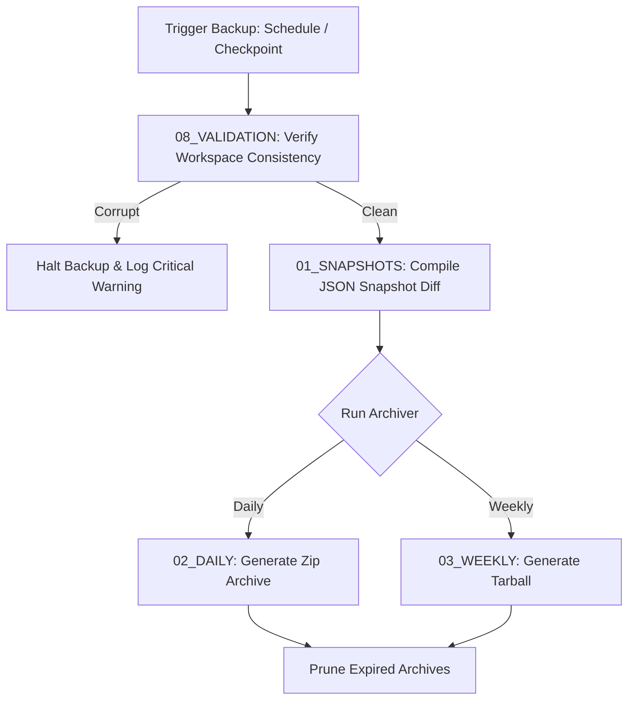

# 💾 Antigravity Backups System (Module 13) — Specification Document
**Version**: 1.0.0  
**Classification**: Tier 4 System Support Layer  
**Status**: Active / Enforced  

---

## 🌌 1. Executive Summary & Purpose

The **Backups Module** (`13_BACKUPS`) is the state preservation, directory archiving, and disaster recovery store of the Antigravity Platform. It maintains immutable snapshots of project databases, code workspaces, and system configurations.

In the event of runtime failures, syntax corruption, directory pollution, or validation breaks, this module provides the baseline states from which the [[15_RECOVERY/SPECIFICATION|Recovery System]] restores the workspace.

---

## 🏛️ 2. Structure & Backup Directories

The `13_BACKUPS` directory contains snapshot tables, compressed daily/weekly archives, and storage strategies:

| Component / Submodule | Purpose & Contents |
| :--- | :--- |
| **`BACKUP_STRATEGY.md`** | Defines backup schedule frequencies, compression models, target paths, and retention limits. |
| **`01_SNAPSHOTS`** | Incremental JSON snapshots (e.g., `snapshot_001.json`) documenting state manager checkpoints. |
| **`02_DAILY`** | Daily compressed zip archives preserving code structures, settings, and workspace files. |
| **`03_WEEKLY`** | Weekly consolidated tarball archives storing complete backups, historical logs, and memory indexes. |

### The Backup Pipeline
Backup creation runs in a strict pipeline to prevent snapshot corruption:

---

## ⚙️ 3. Integration & Strategy

The backup module coordinates with state management and recovery engines:

### 3.1. Incremental Checkpoint Snapshots
- Whenever the State Manager (`09_EXECUTION_ENGINE/05_STATE_MANAGER`) commits a change, the backup system generates an incremental JSON snapshot documenting the diff.
- These snapshots are stored in `01_SNAPSHOTS` and are utilized for quick rollbacks.

### 3.2. Retention and Pruning Policies (`BACKUP_STRATEGY.md`)
- **Snapshots**: Kept for the active session (up to 50 iterations). Older entries are pruned.
- **Daily Archives**: Kept for 7 days.
- **Weekly Archives**: Kept for 4 weeks.

---

## 🛡️ 4. Core Backup Guardrails

1. **Immutability of Archives**: Backups stored in `02_DAILY` and `03_WEEKLY` are write-protected. Once compiled, they cannot be modified or updated.
2. **Pre-Backup Integrity Verification**: The archiver runs checks on workspace code syntax before archiving. Corrupt or uncompilable workstages are rejected to prevent archiving broken states.
3. **Storage Quota Enforcement**: Total backup directory size is capped at 5GB. Storage managers automatically prune oldest archives when the limit is reached.
4. **Exclusions List**: Temporary execution folders (`node_modules`, `dist`, `.git`, `14_SANDBOX/tmp`) are excluded from code backups to keep archives clean.

---

## 🔗 5. Obsidian Semantic Graph & Conventions

- **Semantic Vault Connections**: Links point to recovery and execution modules (e.g., `[[09_EXECUTION_ENGINE/SPECIFICATION|Execution Engine]]`, `[[15_RECOVERY/SPECIFICATION|Recovery System]]`).
- **Archive Backlinks**: Snapshots link back to their originating `task_id` for tracking changes.
- **GFM Formatting**: Backup parameters and schedules are detailed in tables.
