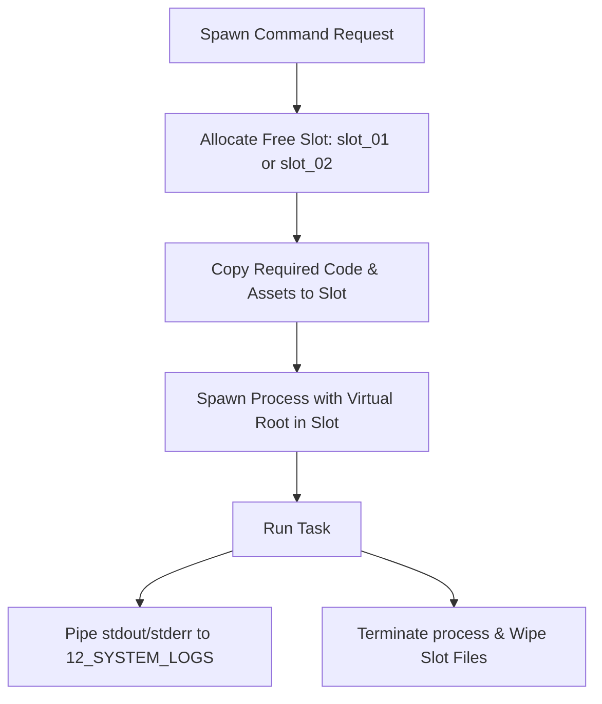

# 📦 Antigravity Sandbox Runtime (Module 14) — Specification Document
**Version**: 1.0.0  
**Classification**: Tier 4 System Support Layer  
**Status**: Active / Enforced  

---

## 🌌 1. Executive Summary & Purpose

The **Sandbox Module** (`14_SANDBOX`) is the secure runtime environment and process isolation layer of the Antigravity Platform. All executable scripts, unit tests, compilations, and third-party skills run inside isolated directories (slots) governed by this module.

Its primary purpose is to shield the host computer from accidental corruption, unauthorized access, and malicious scripts, while exposing controlled pathways for verified execution tasks.

---

## 🏛️ 2. Structure & Slot Allocations

The `14_SANDBOX` directory contains execution slots, temporary storage areas, and configuration parameters:

| Component / Submodule | Purpose & Contents |
| :--- | :--- |
| **`SANDBOX_SPEC.md`** | Defines resource boundaries, execution timeouts, filesystem path restrictions, and network configurations. |
| **`slot_01`, `slot_02`** | Isolated directory directories where code runtimes, simulation runners, and test scripts execute. |
| **`temp`** | Directory for caching compilation targets, temporary assets, and log buffers. |

### Process Isolation Model
Execution runs are jailed inside active slots:

---

## ⚙️ 3. Integration & Sandbox Configurations

The Sandbox interfaces with the execution engine and validation modules:

### 3.1. Filesystem Path Jailing
- Spawning processes are constrained to their allocated slot directories (e.g. `slot_01/`).
- Directory traversal checks block the execution of commands attempting to reference parent directories (using `../`) or absolute host paths.

### 3.2. Host Environment Masking
- System variable environments are scrubbed before starting processes.
- Variable environments are replaced with minimal parameters (e.g., `TEMP`, `PATH` restricted to sandbox scope, `USER` set to virtual parameters).

---

## 🛡️ 4. Core Sandbox Guardrails

1. **Strict Path Limits**: Processes are restricted to read/write files solely inside their allocated `slot/` directory or `temp/` folder. Access to other platform module directories is blocked.
2. **Network Blocking Policies**: Processes running inside the sandbox are blocked from creating outbound sockets unless the active project DNA explicitly permits network access.
3. **Execution Cleanup**: Upon task completion or termination, the active slot is wiped clean of all runtime artifacts to prevent state pollution.
4. **Hanging Process Killing**: Processes exceeding the timeout limits configured in `SANDBOX_SPEC.md` are killed immediately, releasing system resources.

---

## 🔗 5. Obsidian Semantic Graph & Conventions

- **Semantic Vault Connections**: Links back to execution, security, and log modules (e.g., `[[07_SECURITY/SPECIFICATION|Security Engine]]`, `[[09_EXECUTION_ENGINE/SPECIFICATION|Execution Engine]]`, `[[12_SYSTEM_LOGS/SPECIFICATION|System Logs]]`).
- **Standardized MD Formats**: Sandboxed tools specifications and slot statuses are mapped to dashboard nodes.
- **GFM Formatting**: Path jailing tables and environment properties are displayed in GFM.
