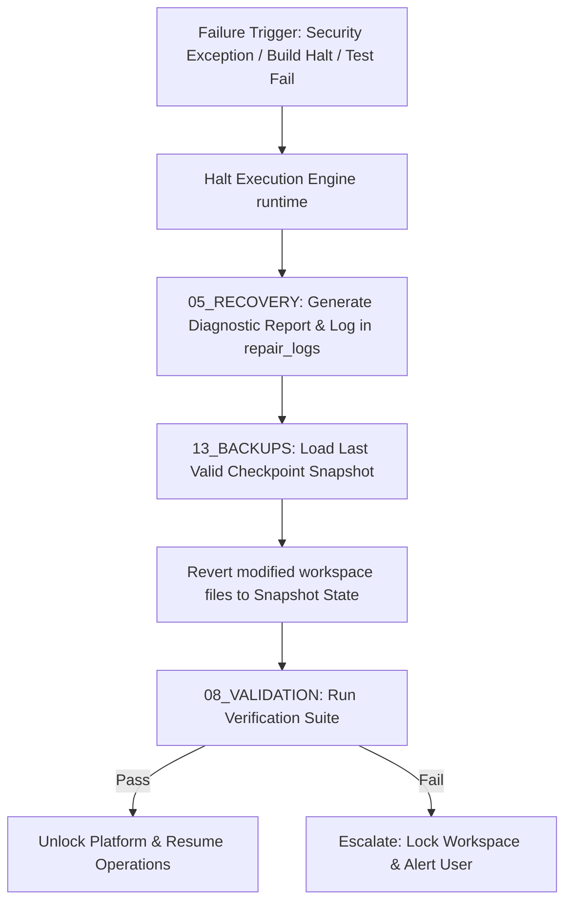

# 🩺 Antigravity Recovery System (Module 15) — Specification Document
**Version**: 1.0.0  
**Classification**: Tier 4 System Support Layer  
**Status**: Active / Enforced  

---

## 🌌 1. Executive Summary & Purpose

The **Recovery Module** (`15_RECOVERY`) is the workspace repair, diagnostic debugger, and automated rollback manager of the Antigravity Platform. Its primary goal is to maintain system stability. When compilation halts, linter gate check failures, security exceptions, or process crashes occur, the recovery engine intervenes to return the platform and project codebases to a verified working state.

By executing transaction rollbacks based on database checkpoints, this module ensures that a failure in an execution step does not result in a corrupted or unusable workspace.

---

## 🏛️ 2. Structure & Submodule Content

The `15_RECOVERY` directory contains restoration scripts, repair traces, and recovery rules:

| Component / Submodule | Purpose & Contents |
| :--- | :--- |
| **`RECOVERY_PROTOCOL.md`** | Declares system failure definitions, rollback sequence triggers, verification checks, and dry-run policies. |
| **`repair_logs`** | Storage directory for crash tracebacks, rollback reports, and diagnostic logs generated during repairs. |

### The Restoration Pipeline
When a recovery trigger fires, the system proceeds through a standardized restoration flow:

---

## ⚙️ 3. Integration & Recovery Protocols

The Recovery module works in conjunction with the validation and backup modules:

### 3.1. Rollback Sequence Triggering
- When a task step fails to validate at Layer 5 or Layer 6 of the validation pipeline, the Validation Agent notifies the Recovery Engine.
- The engine halts active execution slots, locks state mutations, and retrieves the last snapshot from `13_BACKUPS/01_SNAPSHOTS`.

### 3.2. Diagnostic Logging
- System tracebacks, stdout/stderr logs from the crashed slot, and list of reverted files are saved to `15_RECOVERY/repair_logs/repair_<timestamp>.log` for auditing.

---

## 🛡️ 4. Core Recovery Guardrails

1. **Transaction Integrity**: If a rollback itself fails to pass validation checks, the system enters an **Emergency Lockout State**, suspending all automated agent activities and escalating to the user.
2. **Read-Only Lock**: During rollback execution, the active project workspace is marked read-only to prevent subagents from submitting parallel state mutations.
3. **Dry-Run Validation**: Rollback actions are simulated in `14_SANDBOX/temp` first. The system only writes to the live workspace once the dry-run passes validation.
4. **Pruning Repair Logs**: Diagnostic files in `repair_logs` older than 30 days are automatically deleted to maintain disk storage hygiene.

---

## 🔗 5. Obsidian Semantic Graph & Conventions

- **Semantic Vault Connections**: Links point to active engines and back-up stores (e.g., `[[09_EXECUTION_ENGINE/SPECIFICATION|Execution Engine]]`, `[[13_BACKUPS/SPECIFICATION|Backups System]]`, `[[12_SYSTEM_LOGS/SPECIFICATION|System Logs]]`).
- **Obsidian Graph Visibility**: Repair logs link back to the originating task and step nodes to provide graphical visibility into failure hotspots.
- **GFM Layout**: Recovery steps, states, and escalations are structured in clean markdown tables.
