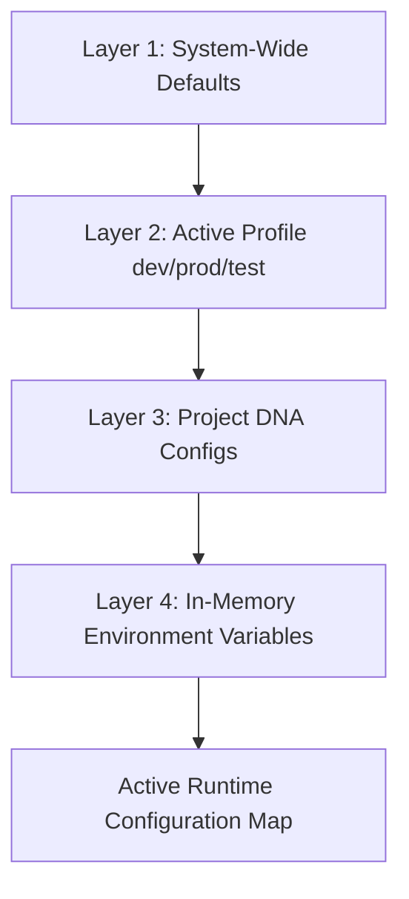
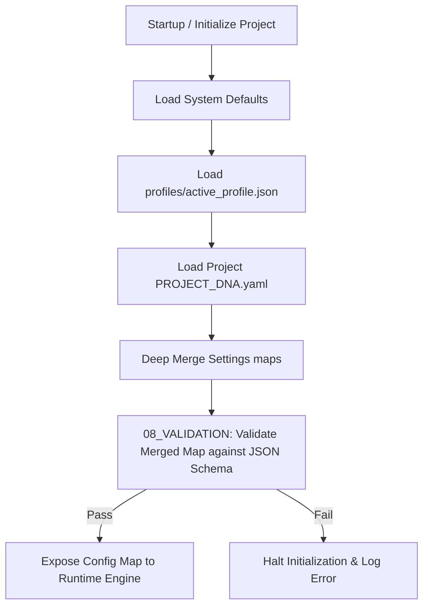

# ⚙️ Antigravity Configuration System (Module 16) — Specification Document
**Version**: 1.0.0  
**Classification**: Tier 4 System Support Layer  
**Status**: Active / Enforced  

---

## 🌌 1. Executive Summary & Purpose

The **Configuration Module** (`16_CONFIG`) is the parameters coordinator, settings validator, and environment mapper of the Antigravity Platform. It maps, loads, and maintains system-wide default settings, operational profiles, and environment variables.

By enforcing a strict precedence hierarchy, the configuration engine allows individual projects to override global parameters (e.g. customized test runners, runtime timeouts) while maintaining the security, resource, and validation constraints declared in the system core.

---

## 🏛️ 2. Structure & Precedence Hierarchy

The `16_CONFIG` directory contains system configuration profiles, default parameters, and precedence rules:

| Component / Submodule | Purpose & Contents |
| :--- | :--- |
| **`CONFIG_MANAGEMENT.md`** | Defines configuration parsing rules, parameter constraints, and schema validation. |
| **`profiles`** | Folder containing predefined environment settings (e.g. `dev.json`, `test.json`, `production.json`). |

### The Configuration Precedence Layering
Settings are loaded sequentially, with downstream layers overriding upstream parameters:

1. **System-Wide Defaults**: Master defaults declared in the system kernel core.
2. **Active Profile**: Settings loaded from `profiles/` mapping the current operational stage.
3. **Project DNA**: Project-level overrides defined in the workspace's `PROJECT_DNA.yaml` file.
4. **Environment Variables**: In-memory variable overrides injected at runtime (highest priority).

---

## ⚙️ 3. Integration & Validation Model

Configuration parameters are loaded, merged, and validated prior to execution:

### 3.1. Deep Merging Settings
- The configuration loader parses settings objects and merges them deep-recursively.
- Overrides are constrained to registered keys; injecting arbitrary, unregistered parameters is blocked.

### 3.2. Schema Validation
- The merged configuration map is validated against JSON schemas in `CONFIG_MANAGEMENT.md` to prevent type mismatches (e.g. string values in timeout properties) or missing required keys.

---

## 🛡️ 4. Core Configuration Guardrails

1. **Immutability of Defaults**: System-wide default configurations are read-only for downstream subagents.
2. **Precedence Protection**: Overrides defined in `PROJECT_DNA.yaml` cannot exceed maximum limits defined in the system defaults (e.g., maximum execution timeout cannot exceed the hard ceiling of 10 minutes).
3. **No Raw Secrets in Configs**: Storing plaintext credentials, tokens, or API keys in configuration profiles is strictly prohibited. Secrets must use environment variable placeholders resolved via `17_SECRETS`.
4. **Validation-First**: If a merged configuration fails schema checks, the loader immediately aborts, preventing execution engine initialization.

---

## 🔗 5. Obsidian Semantic Graph & Conventions

- **Semantic Vault Connections**: Links point to execution, validation, and secret modules (e.g., `[[08_VALIDATION/SPECIFICATION|Validation Engine]]`, `[[17_SECRETS/SPECIFICATION|Secrets Vault]]`).
- **Obsidian Graph Visibility**: Shows how active profiles map to dependencies inside downstream modules.
- **GFM Formatting**: Lists properties, precedence definitions, and validation schemas in clean markdown tables.
