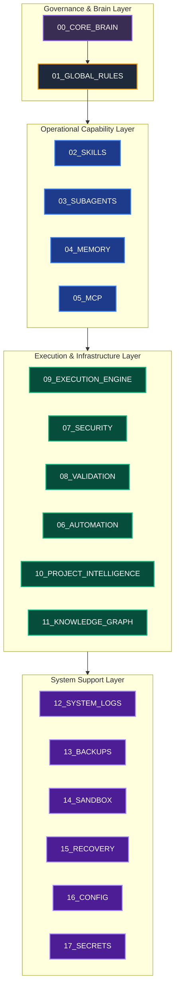

# 🪐 Antigravity Platform

**Supreme Orchestration and Governance Ecosystem for Autonomous Multi-Agent Engineering**

---

## 🌌 Overview

The **Antigravity Platform** is a local-first, deterministic, schema-validated engineering environment built to govern, coordinate, and orchestrate specialized AI agents. Designed for high-reliability systems (e.g., robotics engineering, physical simulations, and safety-critical software), Antigravity bridges the gap between LLM intelligence and deterministic execution pipelines.

All agents and system components operating within the platform are strictly bound by the [[SYSTEM_CONSTITUTION]] and the [[SYSTEM_DNA]].

---

## 🏗️ Architecture

Antigravity is structured in **four logical layers** to enforce separation of concerns, secure sandbox execution, and prevent circular dependencies.



---

## 🗺️ Platform Modules Map

The platform is divided into 18 modules. Each contains specialized stubs and configurations for execution.

| Module | Directory | Description | Documentation |
| :--- | :--- | :--- | :--- |
| **Governance** | [00_CORE_BRAIN](./00_CORE_BRAIN/) | Core identity, DNA, and System Constitution. | [[00_CORE_BRAIN/README]] |
| | [01_GLOBAL_RULES](./01_GLOBAL_RULES/) | Policy rules, architectural laws, and guidelines. | [[01_GLOBAL_RULES/README]] |
| **Operations** | [02_SKILLS](./02_SKILLS/) | System capabilities and semantic routing engine. | [[02_SKILLS/README]] |
| | [03_SUBAGENTS](./03_SUBAGENTS/) | Autonomous multi-agent coordination registry. | [[03_SUBAGENTS/README]] |
| | [04_MEMORY](./04_MEMORY/) | Semantic, vector, and episodic memory systems. | [[04_MEMORY/README]] |
| | [05_MCP](./05_MCP/) | Model Context Protocol server connectors. | [[05_MCP/README]] |
| **Infrastructure**| [06_AUTOMATION](./06_AUTOMATION/) | Event-driven triggers and execution pipelines. | [[06_AUTOMATION/README]] |
| | [07_SECURITY](./07_SECURITY/) | Zero-trust permission limits and token policies. | [[07_SECURITY/README]] |
| | [08_VALIDATION](./08_VALIDATION/) | Pre-execution checking and validation pipelines. | [[08_VALIDATION/README]] |
| | [09_EXECUTION_ENGINE](./09_EXECUTION_ENGINE/) | Topological DAG orchestrator and state engine. | [[09_EXECUTION_ENGINE/README]] |
| | [10_PROJECT_INTELLIGENCE](./10_PROJECT_INTELLIGENCE/) | Project domain classification and DNA parser. | [[10_PROJECT_INTELLIGENCE/README]] |
| | [11_KNOWLEDGE_GRAPH](./11_KNOWLEDGE_GRAPH/) | Entity relationships and query mappings. | [[11_KNOWLEDGE_GRAPH/README]] |
| **Support** | [12_SYSTEM_LOGS](./12_SYSTEM_LOGS/) | Append-only execution and system audit logs. | [[12_SYSTEM_LOGS/README]] |
| | [13_BACKUPS](./13_BACKUPS/) | Immutable state snapshots and archive policies. | [[13_BACKUPS/README]] |
| | [14_SANDBOX](./14_SANDBOX/) | Secure local execution runtime environment. | [[14_SANDBOX/README]] |
| | [15_RECOVERY](./15_RECOVERY/) | Rollobacks, failure recovery, and diagnostic tools. | [[15_RECOVERY/README]] |
| | [16_CONFIG](./16_CONFIG/) | Global settings hierarchy and configurations. | [[16_CONFIG/README]] |
| | [17_SECRETS](./17_SECRETS/) | Secure credential vault and runtime injections. | [[17_SECRETS/README]] |

---

## 🚦 Getting Started

### 1. Requirements
*   **Operating System**: Windows (tested on Windows 11 with PowerShell)
*   **Node.js**: v18.0.0+ (required for the state manager and scripting tools)
*   **Obsidian** (optional but highly recommended for navigating the documentation vault with backlinks)

### 2. Sandbox Setup
All untrusted agents and code actions are executed inside `14_SANDBOX`. Ensure sandbox variables are injected appropriately before starting the master orchestrator.

### 3. Running the Dashboard
The platform provides a web-based visualization dashboard:
```bash
cd dashboard
npm install
npm run dev
```

---

## 📜 Key Architectural Rules

1.  **Direct Import Boundaries**: Infrastructure modules (e.g., `09_EXECUTION_ENGINE`) must not depend directly on specific domain skills (e.g., `02_SKILLS/robotics`). Imports must go through the registry layer.
2.  **Explicit Verification**: No action is executed until the validation pipeline in `08_VALIDATION` yields a `Pass` verdict across all active rule sets.
3.  **Read-First, Update-Last**: All state-modifying tasks must read the active state, apply changes locally, and call the State Manager (`09_EXECUTION_ENGINE/05_STATE_MANAGER`) to commit.

For detailed guidelines, see [[architecture_rules]] and [[engineering_standards]].
